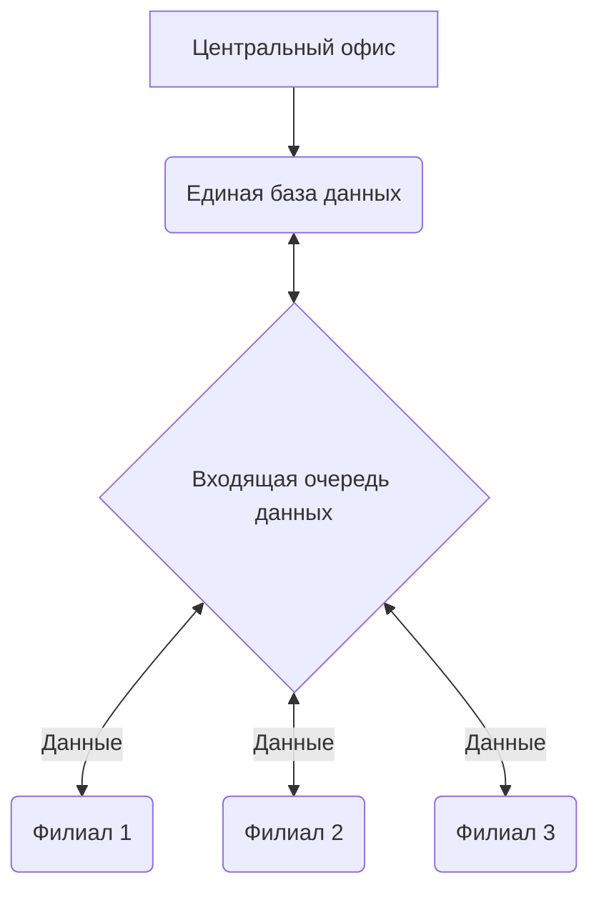
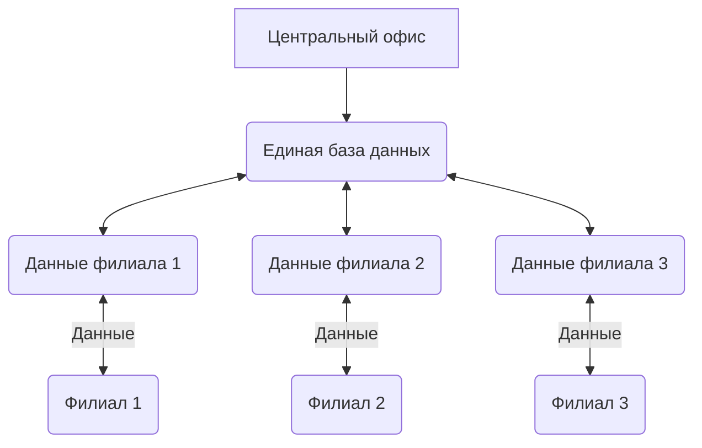
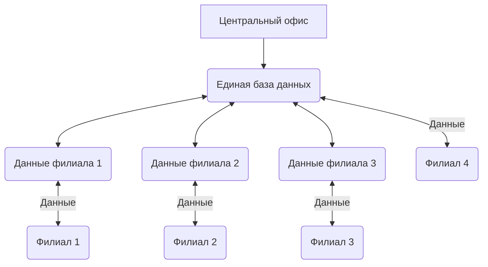
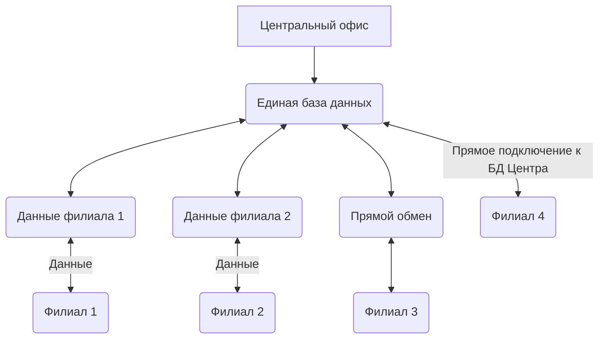

Предприятия, имеющие территориально распределенную структуру, неизбежно сталкиваются с задачей объединения данных о деятельности всех своих подразделений в центральном офисе. Это необходимо для полноценного управления деятельностью компании, для своевременного принятия верных управленческих решений.

Отношения с поставщиками и управление финансовыми потоками, фискальная отчетность и налоговое планирование, управление персоналом и взаимоотношения с клиентами – все эти бизнес-задачи любой коммерческой компании в Сетевых предприятиях принято решать в центральном офисе сети. Такая технология позволяет не только значительно сократить издержки, но и обеспечить более высокую управляемость бизнеса в целом.

Но так ли легко обеспечить актуальную информацию о деятельности удаленных подразделений в центральном офисе компании? Объединить эти данные, предоставив сотрудникам удобные средства для анализа и управления? Конечно, нет.

С увеличением размера сети, технические проблемы сбора информации в центральном офисе и скорости работы программы, становятся все более и более актуальны. Для решения этих проблем, приходится приобретать все более и более дорогое оборудование, и в результате, стоимость владения системой управления может значительно превысить эффект от ее использования.

Мы знали об этой проблеме еще на этапе проектирования системы «Айтида Retail», и реализовали уникальную технологию Айтида NetHive, которая обеспечит стабильную работу любой, даже самой крупной, распределенной сети.

# Традиционные решения организации работы центрального офиса
На сегодняшний день задача объединения данных имеет много известных решений. Лучшие из них связаны со сбором информации о деятельности удаленных подразделений в центральный офис, в единую информационную базу данных сети.

Основным недостатком такой организации работы с данными является быстрое и постоянное увеличение размеров центральной базы данных. Как следствие этого:

## Замедление работы пользователей
- Увеличение размера базы данных неизбежно снижает скорость работы пользователей
- Подключение пользователей к данным, которые им не нужны или не должны быть доступны (к данным некоторых филиалов)
- Постоянно растущие требования к мощности и стоимости центрального сервера, неизбежность остановки сервера на время его модернизации
## Снижение отказоустойчивости системы
- Увеличивается время восстановления системы в случае сбоев
- При полном разрушении центральной базы теряется много времени на загрузку данных из филиалов
## Сложности при обмене данным
- Большинство существующих программ не «умеют» одновременно загружать в центральную базу данные из нескольких филиалов, поэтому создается очередь на загрузку и данные приходят с большой задержкой
- В случаях, если программа позволяет одновременную загрузку данных из нескольких филиалов, это вызывает замедление работы остальных пользователей

# Инновационное решение – Айтида NetHive
Технология, положенная в основу работы с данными компанией Айтида лишена всех перечисленных недостатков. Мы придумали и реализовали уникальное решение, которое позволило отказаться от единой базы данных в центральном офисе.

В изобретенной нами архитектуре хранения данных, база каждого удаленного подразделения хранится в центральном офисе отдельно. Фактически, мы имеем «копию» базы данных филиала в центральном офисе. Именно в эту копию, а не в «общую базу», загружаются обновленные данные из филиала.

Программа (Айтида: Консолидация данных), которая работает в центральном офисе, осуществляет выборку данных, которые необходимы пользователю, автоматически определяя, в какой из баз они физически находятся.

В интерфейсе пользователя, выбор филиалов для работы осуществляется одной кнопкой. Выбор запоминается, и используется далее при открытии журналов документов, формировании отчетов, просмотре справочников до тех пор, пока список выбранных филиалов не будет изменен.

Технология Айтида NetHive не только позволяет избежать известных проблем «типовых решений», но и дает ряд новых, уникальных преимуществ:
## Скорость получения данных
Если пользователю необходима информация о деятельности нескольких подразделений, выборка данных происходит из нескольких баз данных. Важно отметить, что в этом случае выборка происходит одновременно. Это означает, что время получения результата практически не увеличивается с ростом числа филиалов.

При работе с «общей» базой данных, время ответа системы будет пропорционально увеличиваться с появлением каждого нового филиала.

## Полноценная масштабируемость
В архитектуре NetHive, базы данных разных филиалов не только хранятся отдельно, но и могут располагаться на разных серверах. Это не только повышает надежность хранения данных и более равномерно распределяет сетевые потоки, но открывает удивительную возможность масштабирования системы.
В процессе увеличения количества филиалов не обязательно увеличивать мощность центрального сервера – достаточно установить еще один или несколько серверов необходимой производительности для размещения баз новых филиалов.
  
## Филиал On-line
Архитектура системы позволяет в ряде случаев вовсе отказаться от обмена данными. Если между центральным офисом и филиалом существует устойчивая связь (например, Internet соединение), можно совсем отказаться от использования модуля обмена данными. В таком случае база филиала, физически находящаяся на территории удаленного подразделения, может быть подключена к программе в центральном офисе, и информация о деятельности подразделения будет доступна офису в режиме On-Line.
  

Два существенных примечания:

Напомним, программные продукты компании Айтида являются клиент-серверными приложениями. Это означает, что они максимально снижают потоки данных по сети. Поэтому, при использовании варианта «филиала On-Line», для достижения полноценного быстродействия системы будет достаточно скорости соединения, которое может обеспечить обычный ADSL-модем.
Данная технология существенно прогрессивнее известного «терминального» подключения, при котором филиал работает в общей базе центрального офиса, потому что не вызывает остановки работы подразделения в случае повреждения канала связи не занимает ресурсы центрального сервера. Впрочем, режим работы в терминале так же допустим.

## Филиал On-Line Plus

При наличии канала связи с филиалом, можно совместить преимущества архитектуры NetHive и работы филиала в режиме On-Line, обеспечив дополнительную гарантию непрерывности бизнеса распределенной торговой сети.

В центральном офисе сети все же содержится «копия» базы данных удаленного филиала. В форс-мажорных условиях, обновленные данные для этой копии могут поступать по любым каналам связи (на внешних дисках/флешках, электронным письмом и другими). Если соединение с филиалом работает в штатном режиме, программа сама обновляет свою копию в центре. Мгновенно, как только произведены изменения.

## Подразделение, как часть центрального офиса

Многие предприятия, имеющие распределенную структуру филиалов, располагают центральный офис сети в одном из торговых объектов. В этом случае, приходится смириться с одним из двух вариантов – либо сотрудники самого торгового объекта работают прямо в «общей базе сети», либо филиал использует отдельную базу, но периодически обменивается информацией с «центральной», находящейся на том же сервере.

Айтида предлагает новое решение, не содержащее никаких допущений. Торговый объект работает в отдельной собственной базе данных, однако сотрудники центрального офиса в режиме On-line видят все происходящее. Как и в предыдущих примерах, это решение обеспечивается технологией NetHive.

## Если один из серверов «упал»
Однажды в любой организации может сломаться компьютер, на котором хранятся данные. Это может быть как сервер центрального офиса, так и компьютер в удаленном подразделении. Для систем, построенных по технологии единой базы данных, это чревато остановкой работы на длительный срок, даже в том случае, если есть архивы. Причем, восстановление работы филиала не многим проще, чем восстановление центрального офиса.

Но, обратим внимание на важную особенность архитектуры NetHive – дополнительную гарантию защиты от потери данных. Действительно, в случае проблем в центральном офисе, достаточно просто скопировать базу данных из магазина. В случае проблем в филиале – принести «копию» из центрального офиса.

Это дает возможность практически мгновенно восстановить работу предприятия, даже если данные не архивировались.

## Сокращение расходов
Архитектура, разработанная компанией «Айтида» позволяет значительно сократить расходы предприятий и организаций на информационные технологии:

- Не требуется покупка все более и более мощных серверов известных производителей
- Экономия на стоимости лицензий на серверное программное обеспечение
- Повышение надежности работы системы, снижение издержек на ее восстановление
- Дополнительное обеспечение непрерывности бизнеса

> Технология NetHive не просто делает работу сети магазином удобнее. Благодаря этой технологии, торговое предприятие может сделать новый инновационный шаг в управлении своей сетью.
{.is-info}
