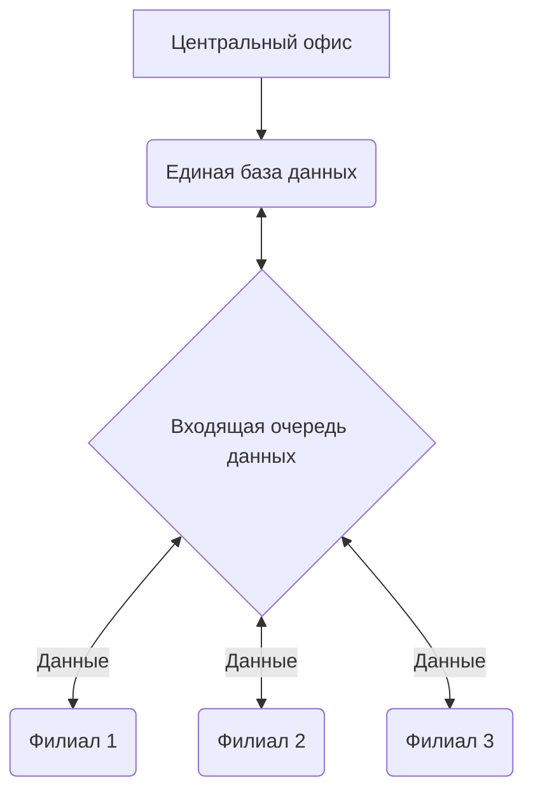

Предприятия, имеющие территориально распределенную структуру, неизбежно сталкиваются с задачей объединения данных о деятельности всех своих подразделений в центральном офисе. Это необходимо для полноценного управления деятельностью компании, для своевременного принятия верных управленческих решений.

Отношения с поставщиками и управление финансовыми потоками, фискальная отчетность и налоговое планирование, управление персоналом и взаимоотношения с клиентами – все эти бизнес-задачи любой коммерческой компании в Сетевых предприятиях принято решать в центральном офисе сети. Такая технология позволяет не только значительно сократить издержки, но и обеспечить более высокую управляемость бизнеса в целом.

Но так ли легко обеспечить актуальную информацию о деятельности удаленных подразделений в центральном офисе компании? Объединить эти данные, предоставив сотрудникам удобные средства для анализа и управления? Конечно, нет.

С увеличением размера сети, технические проблемы сбора информации в центральном офисе и скорости работы программы, становятся все более и более актуальны. Для решения этих проблем, приходится приобретать все более и более дорогое оборудование, и в результате, стоимость владения системой управления может значительно превысить эффект от ее использования.

Мы знали об этой проблеме еще на этапе проектирования системы «Айтида Retail», и реализовали уникальную технологию Айтида NetHive, которая обеспечит стабильную работу любой, даже самой крупной, распределенной сети.

# Традиционные решения организации работы центрального офиса
На сегодняшний день задача объединения данных имеет много известных решений. Лучшие из них связаны со сбором информации о деятельности удаленных подразделений в центральный офис, в единую информационную базу данных сети.

Основным недостатком такой организации работы с данными является быстрое и постоянное увеличение размеров центральной базы данных. Как следствие этого:

## Замедление работы пользователей
- Увеличение размера базы данных неизбежно снижает скорость работы пользователей
- Подключение пользователей к данным, которые им не нужны или не должны быть доступны (к данным некоторых филиалов)
- Постоянно растущие требования к мощности и стоимости центрального сервера, неизбежность остановки сервера на время его модернизации
## Снижение отказоустойчивости системы
- Увеличивается время восстановления системы в случае сбоев
- При полном разрушении центральной базы теряется много времени на загрузку данных из филиалов
## Сложности при обмене данным
- Большинство существующих программ не «умеют» одновременно загружать в центральную базу данные из нескольких филиалов, поэтому создается очередь на загрузку и данные приходят с большой задержкой
- В случаях, если программа позволяет одновременную загрузку данных из нескольких филиалов, это вызывает замедление работы остальных пользователей