# Сокращения {#Сокращения}

|     |     |
| --- | --- |
| ПК  | Персональный Компьютер |
| ЛКМ | Левая Кнопка Мыши |
| ПКМ | Правая Кнопка Мыши |
| ПО  | Программное Обеспечение |
| ОС  | Операционная Система |
| ТМЦ | Товарно-Материальная Ценность |
| ФР  | Фискальный Регистратор |
| ПД  | Принтер Документов |
| ККМ | Контрольно-Кассовая Машина. Для Frontol это фискальный регистратор |
| КС  | Кассовая Смена |
| КПП | Код Причины Постановки на учет |
| ИНН | Идентификационный Номер Налогоплательщика |
| ТСД | Терминал Сбора Данных |
| БД  | База Данных |
| ШК  | Штрих-код |
| ТО  | Торговое Оборудование |
| ДТО | Драйвер Торгового Оборудования |
| РМ  | Рабочее Место |
| МОД | Модуль Обмена Данными |

# Условные обозначения {#УсловныеОбозначения}

> Информация, выделенная таким знаком, является важной и требует обязательного прочтения и/или выполнения.
{.is-warning}

> Информация, выделенная таким знаком, носит ознакомительный и/или рекомендательный характер.
{.is-info}

> Информация, выделенная таким знаком, является примером использования настройки или механизма работы.
{.is-success}

> Информация, выделенная таким знаком, предназначена исключительно для администратора, производящего установку и настройку.

# Назначение {#Назначение}

Большинство неудач при автоматизации связаны с тем, что перед началом проекта не было четко осмыслена его цель. Однако сама по себе система не способна решать проблемы учета. Для успешной работы торгового предприятия необходима еще и технология ведения учета в выбранной программе.

Как показывает практика бессистемный «ручной учет» на предприятии если не всех, то многих устраивает. Внедрение же компьютерной системы ведет за собой проведение некоторой реорганизации бизнес-процессов, что не может не вызвать неудовольствия некоторых сотрудников. Чтобы не потерять значительную долю преимуществ от внедрения современной автоматизированной системы управления, необходимо использовать данный материал.

Данный материал рассказывает о том, как адаптировать, приблизить использование учетных механизмов системы **«Айтида Retail»** к реальным бизнес-процессам торгового предприятия. Большое внимание уделено вопросам подготовки программы к работе, организации документооборота и технологии ведения учета на отдельных участках, обобщения учетных данных и формирования аналитической информации для пользователей.

Предложенная методика поможет избежать типичных ошибок возникающих при внедрении автоматизированных систем управления на розничных предприятиях, обрести лучшее понимание того, что важно для успешной работы и завоевать доверительное отношение сотрудников предприятия.

Описываемая технология автоматизации торговой деятельности направлена на эффективное решение многих организационно-технических задач, которые возникают перед большинством торговых предприятий, таких как:

-   Автоматизация основных процессов на торговом предприятии (приход, расход, ценообразование, инвентаризация, взаиморасчеты и т.д.)

-   Работа с большой номенклатурой товаров.

-   Своевременные и точные отчеты о текущих процессах.

-   Контроль деятельности персонала.

-   Снижение трудозатрат и ошибок персонала (снижение затрат рабочего времени на рутинную работу по заполнению бумажных документов и др.).

-   Корректировка остатков в период между инвентаризациями.

-   Проведение инвентаризации без остановки работы предприятия.

-   Повышение качества и скорости обслуживания клиентов.

-   Наращивание товарооборота и многое др.

# Базовые функциональные возможности {#БазовыеФункциональныеВозможности}

Товарно-материальные ценности (ТМЦ), работы и услуги являются ресурсами, которые могут быть получены от контрагентов или переданы контрагентам. ТМЦ могут быть также списаны, перемещены между подразделениями фирмы.

-   Перечень и описание ТМЦ содержится в **«Справочнике ТМЦ»**.

-   Перечень и описание работ и услуг содержится в **«Справочнике услуг»**.

-   Для отражения поступления закупленных ТМЦ или оприходованных услуг и работ от контрагента используется **«Приходная накладная»**.

-   Проданные ТМЦ могут быть возвращены контрагентом (например, вследствие брака), тогда используется **«Возврат ТМЦ»**.

-   Реализация ТМЦ, выполнение работ, оказание услуг отражается **«Расходной накладной»** и **«Кассовой сменой»**.

-   Перемещения ТМЦ между складами и материально-ответственными лицами отражается **«Внутренним перемещением»**.

-   Списание ТМЦ производится документом **«Списание»**.

-   Для отражения пересортицы на складе, а также некоторых операций по переработке давальческого сырья используется **«Пересортица товаров»**.

О дополнительных возможностях программы по организации документооборота можно судить по списку типовых операций с вовлекаемыми в них документами:

```plantuml
@startmindmap
!theme materia
*[#Orange] Функции
**[#lightblue] Ввод начальных остатков
*** Приходная накладная или инвентаризация
*** Акт переоценки
**[#lightblue] Поступление товара в магазин
*** Приходная накладная
*** Акт переоценки
**[#lightblue] Переоценка товара
*** Акт переоценки
**[#lightblue] Уценка товара
*** Акт пересортицы
*** Акт переоценки
**[#lightblue] Бонус
*** Приходная накладная с видом Бонус
*** Акт переоценки
**[#lightblue] Пересортица
*** Акт пересортицы
**[#lightblue] Продажи товаров
*** Розничные продажи
*** Кассовая смена
*** Акт пересортицы (для Учёта превышений)
**[#lightblue] Возвраты ТМЦ
*** Возвраты от покупателей
**[#lightblue] Оптовые продажи
*** Расходная накладная
*** Счёт-фактура
**[#lightblue] Возвраты ТМЦ поставщикам
*** Возвраты поставщикам
**[#lightblue] Списание брака
*** Списание товаров
**[#lightblue] Перемещения между складами
*** Перемещение
**[#lightblue] Инвентаризация
**[#lightblue] Регламентные  отчеты
*** Товарный отчёт
*** Реестр документов
*** Алкогольная декларация
*** Кассовая книга
*** Книга учета доходов и расходов
*** Отчет по таре
*** Отчет по НДС
**[#lightblue] Анализ ассортимента
*** Закупка товара
*** Остатки товаров
*** Движение товаров
*** Отклонения остатков товара
*** Ведомость учета движения серийных номеров
*** Ведомость учета движения номеров партий
**[#lightblue] Анализ продаж
*** Продажи товаров
*** Продажи товаров по периодам
*** Статистика продаж
*** Сравнение продаж
*** Отчет по обороту
*** Оборачиваемость товаров
*** Анализ продаж
*** Анализ маркетинговых акций
*** АВС - анализ продаж
**[#lightblue] Анализ инвентаризаций
*** Сверка инвентаризаций
*** Анализ инвентаризаций
*** Анализ частичной инвентаризации
*** Естественная убыль
**[#lightblue] Корректировки
*** Пересортица товаров
*** Бонусы
**[#lightblue] Анализ цен
*** История цен
*** Отклонение торговой наценки
*** Прайс-лист
**[#lightblue] Анализ взаиморасчетов
*** Акт сверки взаиморасчетов
*** Ведомость прихода/расхода
*** График платежей
*** Взаиморасчеты по бонусам
*** Остаток на расчетных счетах
**[#lightblue] Производство
*** Акт о реализации и отпуске изделий кухни
*** Ведомость учета движения готовых изделий
*** Ведомость учета движения продуктов и тары
*** Ведомость учета остатков на складе
*** Дневной заборный лист
*** Отчет Материально Ответственных Лиц
**[#lightblue] Заказы
*** Автозаказ
*** Анализ заказов поставщикам
**[#lightblue] Услуги
*** Оказанные услуги
*** Прайс-лист
**[#lightblue] Комиссия
*** Отчет комиссионера
*** Учетная карточка по договорам комиссии
*** Справка о продаже товаров, принятых на комиссию
**[#lightblue] Отчет менеджера
**[#lightblue] Отчет по контрагентам
**[#lightblue] Свод по основным показателям
**[#lightblue] Дополнительные отчеты
*** Дубликаты штрих-кодов
*** Журнал действий пользователей
*** Товары без движения
*** Произвольные отчеты
*** Оперативная сводка (без печатных форм)
*** Отчёт «Взаиморасчёты с контрагентами»
*** Оперативная сводка по ККМ
**[#lightblue] Взаиморасчёты
*** Кассовые документы
*** Приходный кассовый ордер
*** Расходный кассовый ордер
*** Банковские документы
**** Платёжное поручение
**** Приход безналичных денег
**** Банковские выписки
**[#lightblue] Бухгалтерский учет
*** Выгрузка данных в бухгалтерию
@endmindmap
```

